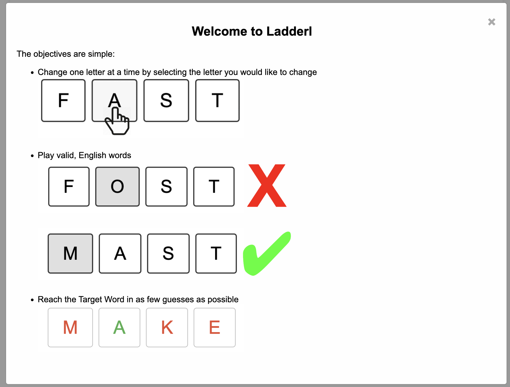
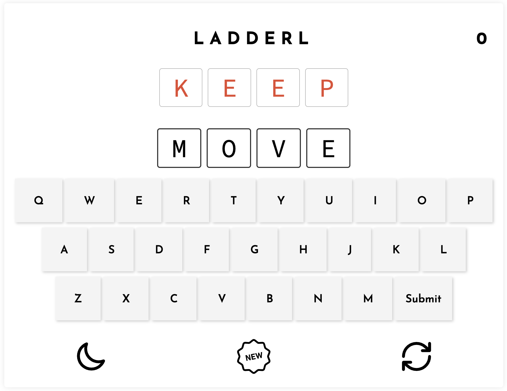

# Ladderl: A Word Adventure!

Embark on a lexical adventure with Ladderl, a captivating word game that challenges your vocabulary and strategic thinking. Transform one word into another through a series of steps, changing one letter at a time, and explore a network of word connections along the way. Whether you're a logophile or a casual gamer, Ladderl offers an intriguing escape into the realm of words.

## Features

- **Engaging Gameplay:** Dive into a unique word puzzle challenge, navigating through letter ladders to reach your goal word.
- **Expansive Word Network:** Discover thousands of word connections and broaden your vocabulary with each game.
- **Single and Multiplayer Modes:** Play solo to sharpen your skills or compete with friends to see who's the true word wizard.
- **Cross-platform:** Enjoy Ladderl on your preferred device; it’s compatible with web, iOS, and Android platforms.
- **Customizable Themes:** Personalize your gameplay experience with a variety of aesthetic themes.

## Installation

1. Clone the repository:
git clone https://github.com/mimcmahon20/Ladderl.git
2. Navigate to the project directory:
cd Ladderl
3. Install the required dependencies:
npm install
4. Start the game:
npm start

## Usage

- Start a new game and enter your goal word.
- Navigate through the word ladder, changing one letter at a time to form new words.
- Challenge your friends and climb the leaderboard!

For more details, check out our [Game Guide](docs/GameGuide.md).

## Contributing

We welcome contributions! Please see the [Contribution Guidelines](CONTRIBUTING.md) for more information.

## License

Ladderl is open-source and is licensed under the [MIT License](LICENSE).

## Contact

Feel free to reach out with questions or feedback:

- GitHub: [@mimcmahon20](https://github.com/mimcmahon20)
- Email: example@example.com

## Acknowledgments

Special thanks to the following APIs that make Ladderl possible:

- **DictionaryAPI:** This API is utilized to verify the validity of words in the game. [API link](https://api.dictionaryapi.dev/api/v2/entries/en)
- **Random Word API:** This API is employed to fetch random words for gameplay, adding an element of surprise to each game session. [API link](https://random-word-api.vercel.app/api?words=1&length=4&type=uppercase)

Your support and resources have been invaluable in the development of Ladderl!
